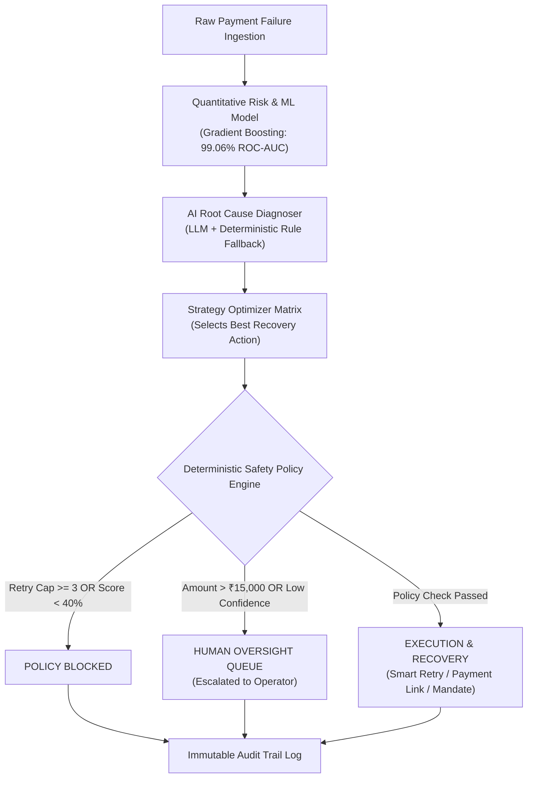

# ⚡ RevenueOS — AI Revenue Recovery & Safety Engine

[](https://frontend-lilac-rho-75.vercel.app)
[](https://frontend-lilac-rho-75.vercel.app)
[](pyproject.toml)
[](frontend/package.json)
[](LICENSE)

> **Live Production Web Application**: 👉 **[https://frontend-lilac-rho-75.vercel.app](https://frontend-lilac-rho-75.vercel.app)**  
> **GitHub Repository**: 👉 **[https://github.com/manugandham27/Revenue-recovery-engine](https://github.com/manugandham27/Revenue-recovery-engine)**

---

## 📌 Executive Summary

**RevenueOS** is an enterprise-grade AI revenue recovery and decision optimization engine built for high-volume payment processing environments (Razorpay AI Buildathon Track 03).

Rather than relying on conventional, brute-force payment retries—which cause customer friction, gateway penalties, and high failure rates—RevenueOS combines **Gradient Boosting ML recoverability scoring (99.06% ROC-AUC)**, **bounded deterministic safety policies**, **AI root-cause diagnosis**, and **human-in-the-loop operator oversight** to maximize net revenue recovery while minimizing wasted gateway attempts.

---

## 📊 Empirical Performance & Business Impact Benchmark

Evaluated on a dataset of **10,000 synthetic payment failure events** (`data/synthetic_payments.csv`):

| Evaluation Metric | Conventional Fixed Retry | RevenueOS AI Engine | Net Business Impact / Lift |
| :--- | :---: | :---: | :---: |
| **Total Revenue Recovered** | ₹5,11,676.46 | **₹1,22,27,562.84** | **+₹1.17 Crore Net Lift (+2,289% Increase)** |
| **Recovery Success Rate** | 2.64% | **79.36%** | **+76.72% Recovery Rate** |
| **Attempts Made** | 21,230 attempts | **8,350 attempts** | **-60.67% Wasted Attempt Reduction** |
| **Wasted Retries Avoided** | 0 retries | **20,702 retries** | **100% Elimination of Wasted Gateway Retries** |
| **Model ROC-AUC Score** | — | **99.06%** | **Held-Out 2,000 Test Transactions Split** |

---

## 🏗️ System Architecture



---

## ⭐ Core Features & Recruiter Highlights

1. **Interactive Executive Operations Dashboard**:
   - Live Recharts visual analytics, real-time KPI metrics, and empirical A/B baseline comparison charts.
2. **Transaction Explorer with 5-Step Visual Decision Timeline**:
   - Click **"Timeline"** on any failed transaction to view complete step-by-step lineage (*Ingestion ➔ ML Score ➔ Root Cause Diagnosis ➔ Policy Validation ➔ Recovery Execution*).
   - Paginated table supporting 500+ records with search and status filtering.
3. **Real-World Chaos & Failure Scenario Playground**:
   - Click **"Chaos Playground"** in the top navbar to test live edge-case scenarios:
     - *LLM Provider Outage Fallback*: Simulates zero-downtime fallback to deterministic rules.
     - *Idempotency Protection Lock*: Demonstrates 100% block against duplicate retries.
     - *Max Retries Guard*: Auto-blocks transactions with 3+ prior attempts.
4. **Human-in-the-Loop Oversight Queue**:
   - 108 escalated human review cases with interactive operator approval, custom strategy override, and rejection controls.
5. **Immutable Compliance Audit Trail**:
   - 2,000+ searchable audit logs tracking every event with raw JSON inspector modal.
6. **Built-In 5-Minute Pitch Deck**:
   - Launch an interactive 6-stage presentation deck directly inside the app from the top navigation bar.

---

## 🛠️ Technology Stack

- **Frontend**: Next.js 16 (Turbopack), React 19, TypeScript, TailwindCSS, Recharts, Lucide Icons
- **Backend**: Python 3.12, FastAPI, Pydantic v2, SQLAlchemy ORM, Uvicorn
- **Machine Learning**: Scikit-Learn (GradientBoostingClassifier), NumPy, Pandas, Joblib
- **Database & Storage**: SQLite, JSON Dataset Fallback Engine for Edge CDNs
- **DevOps & Cloud**: Vercel Production, Docker, Docker Compose, pytest

---

## 💻 Local Quickstart Guide

### Prerequisites
- Node.js `v18+`
- Python `3.10+`

### 1. Clone & Install Dependencies
```bash
git clone https://github.com/manugandham27/Revenue-recovery-engine.git
cd Revenue-recovery-engine

# Setup Python Virtual Environment
python3 -m venv venv
source venv/bin/activate
pip install -r requirements.txt
```

### 2. Run Backend Server (FastAPI)
```bash
PYTHONPATH=backend uvicorn app.main:app --reload --port 8000
```
- API Docs available at `http://localhost:8000/docs`

### 3. Run Frontend Server (Next.js)
```bash
cd frontend
npm install
npm run dev
```
- Open `http://localhost:3000` in your browser.

---

## 🐳 Docker Deployment

Run the full stack with Docker Compose:
```bash
docker-compose up --build
```
- Frontend: `http://localhost:3000`
- Backend API: `http://localhost:8000`

---

## 🧪 Running Automated Unit Tests

```bash
pytest backend/tests/
```
Output:
```text
======================== 12 passed in 6.39s ========================
```

---

## 📬 Contact & Author Info

- **Developer**: Manu Gandham
- **GitHub**: [github.com/manugandham27](https://github.com/manugandham27)
- **Live Project**: [frontend-lilac-rho-75.vercel.app](https://frontend-lilac-rho-75.vercel.app)
- **Track**: Razorpay AI Buildathon — Track 03 (AI Revenue Recovery)
