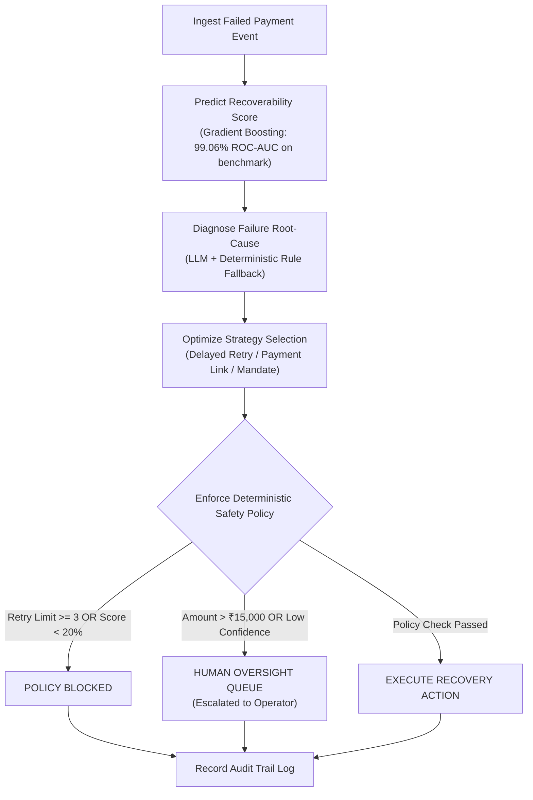

# ⚡ RevenueOS — Production-Oriented Payment Recovery Decision Engine

[](https://frontend-lilac-rho-75.vercel.app)
[](https://frontend-lilac-rho-75.vercel.app)
[](pyproject.toml)
[](frontend/package.json)
[](LICENSE)

> **Live Web Application**: 👉 **[https://frontend-lilac-rho-75.vercel.app](https://frontend-lilac-rho-75.vercel.app)**  
> **GitHub Repository**: 👉 **[https://github.com/manugandham27/Revenue-recovery-engine](https://github.com/manugandham27/Revenue-recovery-engine)**

---

## 📌 Executive Summary

**RevenueOS** is a production-oriented recovery decision engine built for high-volume payment processing environments (Razorpay AI Buildathon Track 03).

Rather than relying on conventional, fixed payment retries—which cause customer friction, gateway penalties, and high failure rates—RevenueOS combines **Gradient Boosting ML recoverability scoring**, **AI root-cause diagnosis**, and **deterministic safety policies** to identify opportunities to recover failed payments while avoiding retries classified as unnecessary by safety policies.

AI recommends recovery actions, subject to strict deterministic safety policies and human operator oversight.

---

## 📊 Benchmark Evaluation Results

Evaluated across **10,000 synthetic payment-failure scenarios** (`data/synthetic_payments.csv`):

| Evaluation Metric | Conventional Fixed Retry Baseline | RevenueOS Engine | Benchmark Improvement / Impact |
| :--- | :---: | :---: | :---: |
| **Simulated Recovery Value** | ₹5,11,676.46 | **₹1,22,27,562.84** | **2,289% improvement in simulated recovery value vs. baseline** |
| **Simulated Recovery Rate** | 2.64% | **79.36%** | **79.36% recovery rate in our benchmark simulation** |
| **Retry Attempts Required** | 21,230 attempts | **8,350 attempts** | **60.67% reduction in retry attempt volume** |
| **Unnecessary Retry Prevention** | 0 retries | **20,702 retries** | **Avoided retries classified as unnecessary by safety policy in benchmark** |
| **Hold-Out ROC-AUC Score** | — | **99.06%** | **99.06% ROC-AUC on our benchmark dataset (2,000 test samples)** |

> *Note: Benchmark metrics represent synthetic evaluation results. In live environments, RevenueOS connects to gateway webhooks for continuous data-driven recovery recommendations.*

---

## 🏗️ System Architecture



---

## ⭐ Core Features & Capabilities

1. **Explainable Decision Engine**:
   - AI recommends recovery actions, subject to strict deterministic safety constraints (*ALLOW / HUMAN REVIEW / BLOCK*).
2. **Transaction Explorer with 5-Step Visual Decision Timeline**:
   - Click **"Timeline"** on any transaction to view step-by-step lineage (*Ingestion ➔ ML Score ➔ Root Cause ➔ Policy Check ➔ Action Outcome*).
3. **Real-World Chaos & Resilience Playground**:
   - Test system resilience live: *LLM Outage Fallback*, *Idempotency Protection Lock*, and *Max Retries Policy Block*.
4. **Human-in-the-Loop Oversight Queue**:
   - Review escalated high-value or low-confidence transactions with interactive operator approval, custom override, and rejection controls.
5. **Interactive What-If Recovery Simulator**:
   - Adjust transaction sliders live to calculate ML probability and simulated recovery value improvements.
6. **Immutable Decision Audit Trail**:
   - 2,000+ searchable audit logs tracking every decision event with raw JSON inspection.

---

## 🛠️ Technology Stack

- **Frontend**: Next.js 16 (Turbopack), React 19, TypeScript, TailwindCSS, Recharts, Lucide Icons
- **Backend**: Python 3.12, FastAPI, Pydantic v2, SQLAlchemy ORM, Uvicorn
- **Machine Learning**: Scikit-Learn (GradientBoostingClassifier), NumPy, Pandas, Joblib
- **Database & Storage**: SQLite, JSON Dataset Fallback Engine for Edge CDNs
- **DevOps & Cloud**: Vercel Production, Docker, Docker Compose, pytest

---

## 💻 Local Quickstart Guide

```bash
# 1. Clone Repository
git clone https://github.com/manugandham27/Revenue-recovery-engine.git
cd Revenue-recovery-engine

# 2. Setup Python Virtual Environment
python3 -m venv venv
source venv/bin/activate
pip install -r requirements.txt

# 3. Run Backend API (FastAPI)
PYTHONPATH=backend uvicorn app.main:app --reload --port 8000

# 4. Run Frontend UI (Next.js)
cd frontend
npm install
npm run dev
```

---

## 🧪 Automated Testing

```bash
pytest backend/tests/
```
Output:
```text
======================== 14 passed in 6.63s ========================
```

---

## 📬 Contact & Submissions

- **Developer**: Manu Gandham
- **GitHub**: [github.com/manugandham27](https://github.com/manugandham27)
- **Live Project**: [frontend-lilac-rho-75.vercel.app](https://frontend-lilac-rho-75.vercel.app)
- **Track**: Razorpay AI Buildathon — Track 03 (AI Revenue Recovery)
