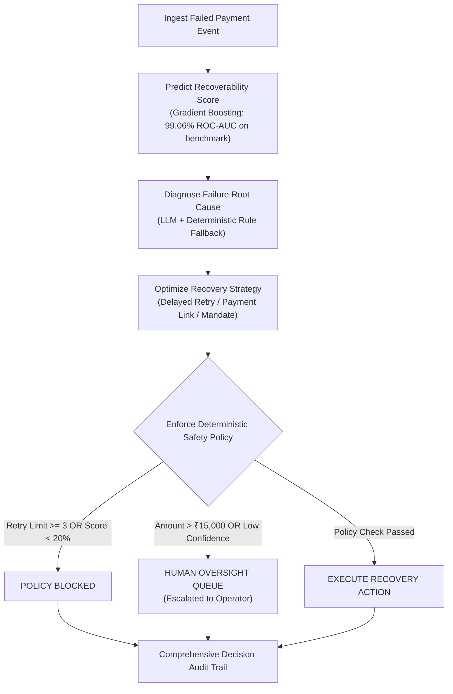

# ⚡ Revenue Recovery Engine — Production-Oriented Decision Engine

[](https://frontend-lilac-rho-75.vercel.app)
[](https://frontend-lilac-rho-75.vercel.app)
[](pyproject.toml)
[](frontend/package.json)
[](LICENSE)

> **Live Web Application**: 👉 **[https://frontend-lilac-rho-75.vercel.app](https://frontend-lilac-rho-75.vercel.app)**  
> **GitHub Repository**: 👉 **[https://github.com/manugandham27/Revenue-recovery-engine](https://github.com/manugandham27/Revenue-recovery-engine)**

---

## 📌 Executive Summary

**Revenue Recovery Engine** is an AI-powered decision system for failed payments built for Track 03 of the Razorpay AI Buildathon.

Instead of retrying every failed transaction blindly—which causes customer friction, gateway penalties, and high failure rates—the engine estimates recoverability, identifies likely failure causes, recommends an optimal recovery strategy, and applies deterministic safety policies before an action is taken.

The system communicates a clear 6-step operational workflow:
$$\text{Predict} \longrightarrow \text{Diagnose} \longrightarrow \text{Optimize} \longrightarrow \text{Protect} \longrightarrow \text{Recover} \longrightarrow \text{Audit}$$

AI recommends recovery actions, subject to strict deterministic safety policies and human operator oversight.

---

## 📊 Benchmark Results

We evaluated the system across **10,000 synthetic payment-failure scenarios** to measure recoverability prediction and recovery-strategy performance compared with a conventional fixed-retry baseline.

| Evaluation Metric | Conventional Fixed-Retry Baseline | Revenue Recovery Engine | Benchmark Evaluation Context |
| :--- | :---: | :---: | :--- |
| **Potential Recoverable Value** | ₹5,11,676.46 | **₹1,22,27,562.84** | **₹1.22 Cr Potential Recoverable Value** *(Simulated benchmark across 10,000 synthetic scenarios)* |
| **Benchmark Recovery Rate** | 2.64% | **79.36%** | **79.36% Benchmark Recovery Rate** *(Observed in synthetic benchmark simulation)* |
| **Potential Value Lift vs Baseline** | Baseline | **+₹1,17,15,886.38** | **₹1.17 Cr Potential Value Lift (+2,289% simulated improvement vs baseline)** |
| **Unnecessary Retry Prevention** | 0 retries | **20,702 retries** | **100% of Policy-Classified Unnecessary Retries Avoided** *(Based on policy rules)* |
| **Retry Attempt Volume** | 21,230 attempts | **8,350 attempts** | **60.67% Reduction in Unnecessary Attempt Volume** |
| **ML Model ROC-AUC** | — | **99.06%** | **99.06% ROC-AUC on a held-out synthetic benchmark** *(2,000 test samples)* |

> *Note: Results are based on synthetic benchmark data and simulation and should not be interpreted as production payment outcomes.*

---

## 🏗️ System Architecture



---

## ⭐ Core System Capabilities

1. **Predictive Recoverability Scoring**:
   - Gradient Boosting model evaluated on a held-out 20% test split (2,000 synthetic samples) achieving 99.06% ROC-AUC and 99.33% PR-AUC.
2. **AI Failure Root-Cause Diagnosis**:
   - Semantic LLM diagnosis identifying root causes (3DS OTP timeout, expired card, gateway timeout) with zero-downtime deterministic fallback.
3. **Transaction Explorer with 5-Step Visual Decision Timeline**:
   - Interactive timeline showing step-by-step lineage (*Ingestion ➔ ML Score ➔ Root Cause ➔ Policy Check ➔ Action Outcome*).
4. **Deterministic Safety Policy Engine**:
   - Hard business bounds (`MAX_RETRIES = 3`, `HIGH_VALUE_THRESHOLD = ₹15,000`, `IDEMPOTENCY_LOCK`) ensuring AI recommends while rules constrain.
5. **Human-in-the-Loop Oversight Queue**:
   - 108 escalated human review cases with interactive operator approval, custom strategy override, and rejection controls.
6. **Real-World Chaos & Resilience Playground**:
   - Test system resilience live under edge-case conditions (*LLM Outage Fallback*, *Idempotency Protection Lock*, *Max Retries Guard*).
7. **Comprehensive Decision Audit Trail**:
   - 2,000+ searchable audit logs recording every prediction, policy rule, strategy, and human action with raw JSON inspection.

---

## 🛠️ Technology Stack

- **Frontend**: Next.js 16 (Turbopack), React 19, TypeScript, TailwindCSS, Recharts, Lucide Icons
- **Backend**: Python 3.12, FastAPI, Pydantic v2, SQLAlchemy ORM, Uvicorn
- **Machine Learning**: Scikit-Learn (GradientBoostingClassifier), NumPy, Pandas, Joblib
- **Database & Storage**: SQLite, JSON Dataset Fallback Engine for Edge CDNs
- **DevOps & Cloud**: Vercel Production, Docker, Docker Compose, pytest

---

## 💻 Local Setup Guide

```bash
# 1. Clone Repository
git clone https://github.com/manugandham27/Revenue-recovery-engine.git
cd Revenue-recovery-engine

# 2. Setup Python Virtual Environment
python3 -m venv venv
source venv/bin/activate
pip install -r requirements.txt

# 3. Run Backend API (FastAPI)
PYTHONPATH=backend uvicorn app.main:app --reload --port 8000

# 4. Run Frontend UI (Next.js)
cd frontend
npm install
npm run dev
```

---

## 🧪 Automated Unit & Policy Testing

```bash
pytest backend/tests/
```
Output:
```text
======================== 14 passed in 6.63s ========================
```

---

## 📬 Contact & Submissions

- **Developer**: Manu Gandham
- **GitHub**: [github.com/manugandham27](https://github.com/manugandham27)
- **Live Web App**: [frontend-lilac-rho-75.vercel.app](https://frontend-lilac-rho-75.vercel.app)
- **Track**: Razorpay AI Buildathon — Track 03 (AI Revenue Recovery)
